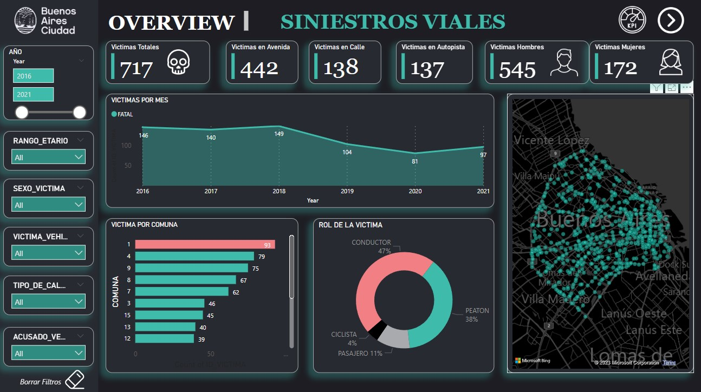
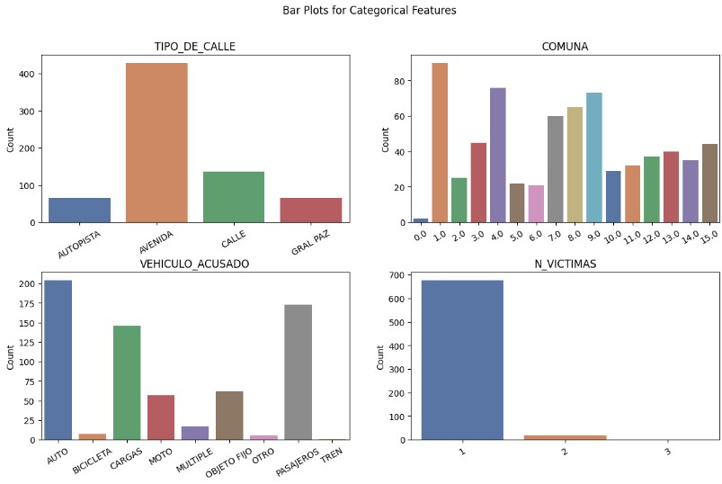
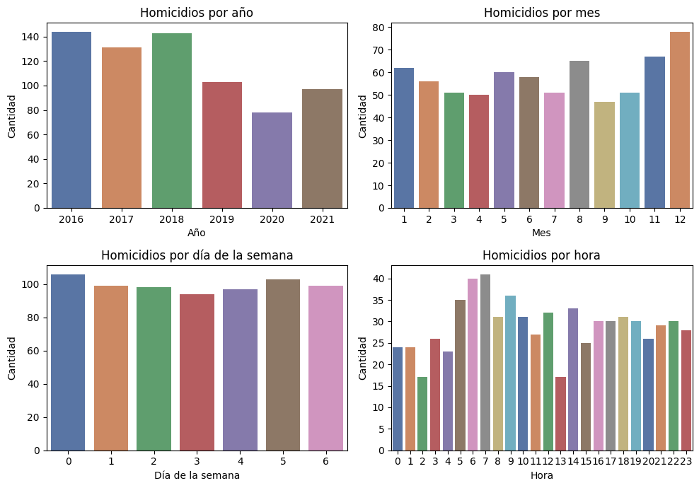
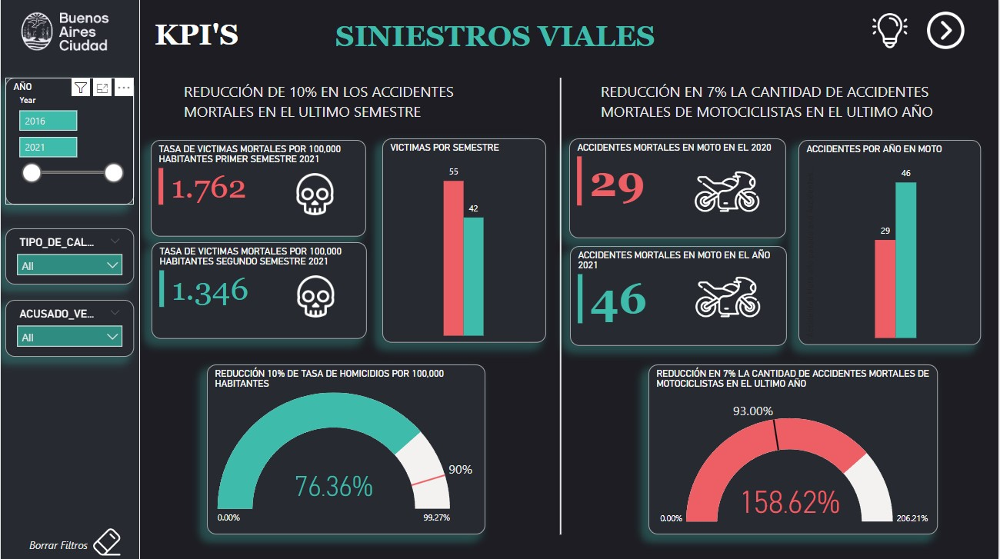

<!-- inserta una imagen de un accidente vial -->

### [POWER BI - SINIESTROS VIALES](https://github.com/OctavioRdz17/Power_BI_Siniestros_Viales)
##### by Octavio Rodriguez Rojas.

## ETL
El archivo 01_ETL.ipynb contiene el código para la extracción, transformación y carga de los datos de accidentes viales en la Ciudad de Buenos Aires. Los datos se obtuvieron de la página de datos abiertos de la Ciudad de Buenos Aires. El archivo contiene los siguientes pasos:
1. Extracción de los datos de la página de datos abiertos de la Ciudad de Buenos Aires.
2. Transformación de los datos para obtener un dataframe con las columnas de interés.
3. Carga de los datos en un archivo csv.

## EDA
El archivo 02_EDA.ipynb contiene el código para el análisis exploratorio de los datos de accidentes viales en la Ciudad de Buenos Aires. El archivo contiene los siguientes pasos:
1. Lectura de los datos de accidentes viales en la Ciudad de Buenos Aires.
2. Análisis exploratorio de los datos. algunos de los análisis se pueden ver en las siguientes imágenes:

3. Visualización de los datos.

## DASHBOARD EN POWER BI
El archivo [Siniestros-Viales.pbix](./Siniestros-Viales.pbix) contiene el dashboard de accidentes viales en la Ciudad de Buenos Aires. El dashboard contiene los siguientes elementos:

### OVERVIEW
1. Mapa de la Ciudad de Buenos Aires con los accidentes viales.
2. Gráfica de area con los accidentes viales por fecha.
3. Gráfica de barras con los accidentes por comuna.
4. Gráfica de barras con los accidentes por tipo de calle.
5. Gráfica de pies con los accidentes por rango de edad.
6. Filtros para la manipulación de los datos.

### KPIS
1. KPI reducción en accidentes viales mortales en un 10% de los últimos 6 meses

2. KPI reducción en accidentes viales mortales en motocicleta en un 7% de el ultimo año

## CONCLUSIONES

los Accidentes de la ciudad de Buenos Aires se han reducido mas de lo esperando con la metrica planteada por el gobierno de la ciudad, sin embargo, los accidentes viales mortales en motocicleta no han tenido una reducción significativa, por lo que se debe de poner especial atención en este tipo de accidentes.

Se pueden ver en los datos que los hombres son los que mas accidentes viales tienen, por lo que se debe de poner especial atención en este grupo de la población y sobre todo en el rango de edad entre 20 y 40 años.

## RECOMENDACIONES

Se recomienda que el gobierno de la ciudad de Buenos Aires ponga especial atención en los accidentes viales mortales en motocicleta, ya que estos no han tenido un aumento significativo, por lo que se debe de poner especial atención en este tipo de accidentes.

## DATOS

EL repositorio contiene los siguientes archivos:

| Archivo | Descripción |
| ------- | ----------- |
| [01_ETL.ipynb](./01_ETL.ipynb) | Código para la extracción, transformación y carga de los datos de accidentes viales en la Ciudad de Buenos Aires. |
| [02_EDA.ipynb](./02_EDA.ipynb) | Código para el análisis exploratorio de los datos de accidentes viales en la Ciudad de Buenos Aires. |
| [Siniestros-Viales.pbix](./Siniestros-Viales.pbix) | Dashboard de accidentes viales en la Ciudad de Buenos Aires. |
| [datasets](./data) | Carpeta con los datos de accidentes viales en la Ciudad de Buenos Aires. |
| [src](./src) | Carpeta con las imágenes del README.md. |
| [README.md](./README.md) | Archivo con la descripción del proyecto. |

## LINKS

- Repositorio de github: [link](https://github.com/OctavioRdz17/Power_BI_Siniestros_Viales)  
- Datasets originales: [link](https://data.buenosaires.gob.ar/dataset/victimas-siniestros-viales)

